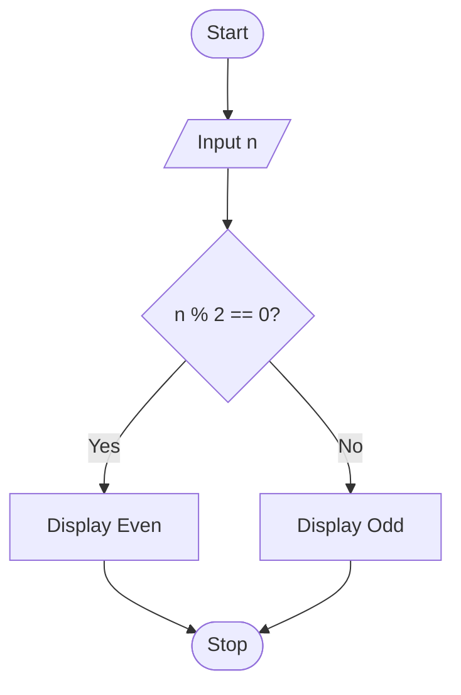

# Algorithm

1. Start.
2. Read an integer n.
3. Find n modulo 2.
4. If the remainder is zero, display Even; otherwise display Odd.
5. Stop.

## Flowchart

```mermaid
flowchart TD
 A([Start]) --> B[/Input n/]
 B --> C{n % 2 == 0?}
 C -->|Yes| D[Display Even]
 C -->|No| E[Display Odd]
 D --> F([Stop])
 E --> F
```
