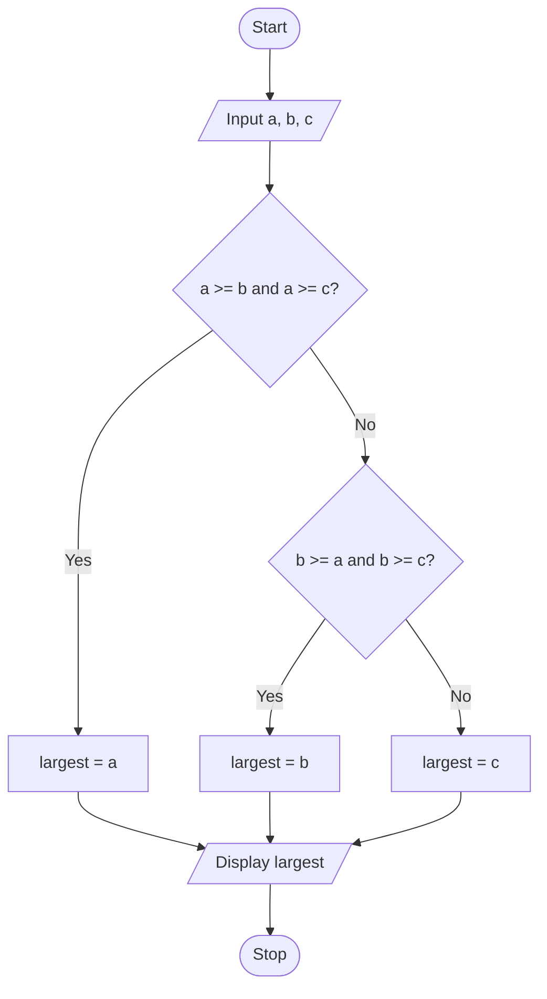

# Algorithm

1. Start.
2. Read a, b and c.
3. If a >= b and a >= c, largest = a.
4. Else if b >= a and b >= c, largest = b.
5. Otherwise largest = c.
6. Display largest and stop.

## Flowchart

```mermaid
flowchart TD
 A([Start]) --> B[/Input a, b, c/]
 B --> C{a >= b and a >= c?}
 C -->|Yes| D[largest = a]
 C -->|No| E{b >= a and b >= c?}
 E -->|Yes| F[largest = b]
 E -->|No| G[largest = c]
 D --> H[/Display largest/]
 F --> H
 G --> H
 H --> I([Stop])
```
