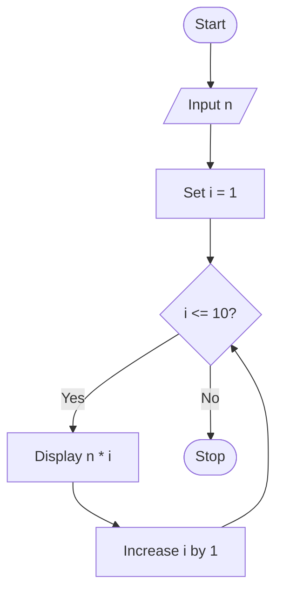

# Algorithm

1. Start.
2. Read number n.
3. Repeat i from 1 through 10.
4. Display n multiplied by i.
5. Stop after the loop.

## Flowchart

```mermaid
flowchart TD
 A([Start]) --> B[/Input n/]
 B --> C[Set i = 1]
 C --> D{i <= 10?}
 D -->|Yes| E[Display n * i]
 E --> F[Increase i by 1]
 F --> D
 D -->|No| G([Stop])
```
